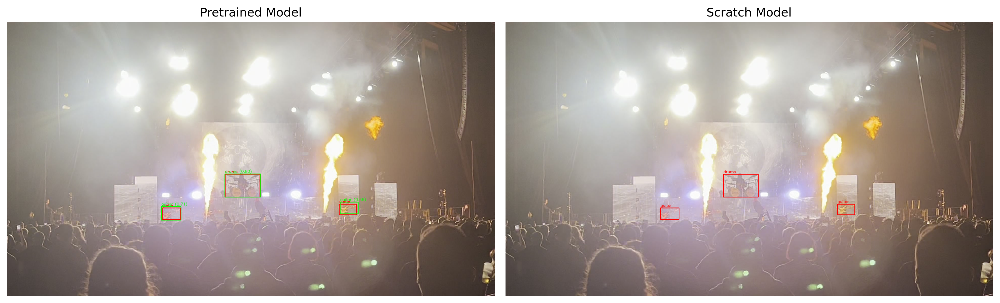

<div align="center">

# EVOLVE

### *Extreme Vision Over Low-light and Volatile Environments*

[](https://www.python.org/)
[](https://pytorch.org/)
[](https://github.com/ultralytics/ultralytics)
[]()

*Master 2 SISE Project - Computer Vision*  
*Université Lumière Lyon 2 | 2025–2026*

---

</div>


## Overview

**EVOLVE** is a structured object detection study focused on visually challenging real-world environments, using live metal concert imagery as a representative challenging domain.

Live metal concert imagery is used as a representative domain combining multiple simultaneous visual challenges:
- Low and highly uneven illumination
- Rapid chromatic shifts (red / blue dominant lighting)
- Motion blur
- High crowd density
- Severe occlusion
- Camera instability

These conditions generate strong variability in scene-level visual properties.

Beyond measuring detection performance under these conditions, EVOLVE investigates the following question:

> To what extent can variations in object detection performance be explained by measurable scene-level properties?

The project aims to quantify the relationship between environmental descriptors (e.g., luminance, blur, density) and detection metrics.

---

## Research Orientation

EVOLVE EVOLVE integrates:

- Structured dataset construction
- Annotation calibration and agreement analysis
- Controlled luminance stratification
- Quantitative performance modeling

The emphasis is placed on:

- Experimental control
- Statistical rigor
- Measurement transparency
- Reproducibility

Annotation is treated as a measurable experimental component rather than a preprocessing formality.

---

## Dataset Construction

The dataset is built through a multi-stage controlled pipeline:

```
Raw video collection
↓
Frame extraction
↓
Luminance computation
↓
Stratified sampling
↓
Calibration subset creation
↓
Manual annotation (CVAT)
↓
Quality control
↓
Train / validation split
```

Full details are documented in:

- `doc/dataset_pipeline.md`
- `doc/calibration_protocol.md`
- `doc/inter_annotator_analysis.md`

### Data Sources

- Personal concert footage
- Public YouTube videos (research use only)

The dataset is **not distributed** due to licensing constraints.

## Dataset Statistics

| Split | Images |
|-------|--------|
| Train | 560 |
| Validation | 70 |
| Test | 70 |

Total images: 700

### Class Distribution (Training Set)

| Class | Instances |
|-------|-----------|
| amp | 744 |
| guitar | 440 |
| drums | 287 |
| micro | 275 |
| mosh_pit | 83 |
| hands_raised | 498 |

### Global Class Distribution (All Splits)

| Class | Instances |
|-------|-----------|
| amp | 879 |
| guitar | 494 |
| drums | 339 |
| micro | 329 |
| mosh_pit | 99 |
| hands_raised | 593 |

---

## Target Classes

| Class | Description |
|-------|------------|
| `amp` | Stage amplifiers or monitors |
| `guitar` | Guitar or bass instruments |
| `drums` | Drum kit or drum elements |
| `micro` | Vocal microphones |
| `mosh_pit` | Collective dynamic crowd movement |
| `hands_raised` | Clusters of raised arms |

The `mosh_pit` class represents a collective behavioral phenomenon rather than a discrete object, introducing structural annotation complexity.

---

## Modeling

- Framework: PyTorch  
- Detector: YOLOv8 (Ultralytics)  
- Training approach: transfer learning from COCO pre-trained weights  
- Controlled comparison: pretrained vs training-from-scratch
- Evaluation stratified by luminance categories  

---

## Evaluation Strategy

### Quantitative Metrics

- mAP (50 and 50-95)
- Precision / Recall per class
- IoU
- Stratified performance comparison

### Qualitative Analysis

- Failure case inspection
- Lighting-dependent degradation
- Dense-scene ambiguity
- Class-specific instability patterns

---

## Key Experimental Results

### Validation Performance

| Model | mAP@0.5:0.95 | mAP@0.5 |
|-------|--------------|---------|
| Pretrained (COCO) | ~0.17 | ~0.30 |
| Scratch | ~0.03 | ~0.08 |

Transfer learning yields a substantial performance gain under extreme lighting conditions.

Training from scratch fails to converge to competitive detection performance, highlighting the importance of prior visual knowledge in low-light, high-variance domains.

### Scene-Level Correlation Analysis (Pretrained Model)

| Variable | r | R² | p-value | Interpretation |
|----------|----|------|----------|---------------|
| Mean luminance | 0.391 | 0.153 | 0.001 | Moderate positive correlation |
| Blur | -0.110 | 0.012 | 0.364 | Not significant |
| Density | -0.080 | 0.006 | 0.511 | Not significant |
| Occupied area | -0.070 | 0.005 | 0.567 | Not significant |

Detection recall is significantly associated with scene luminance (p = 0.001), whereas blur and structural density do not exhibit statistically significant influence in this dataset.

## Qualitative Comparison

Example detection output on a high-illumination but high-glare frame:

<p align="center">
  
</p>

The pretrained model correctly detects drums and guitar elements under extreme brightness and glare conditions, whereas the scratch model exhibits reduced localization accuracy and missed detections.

### Main Takeaway

Object detection performance in extreme concert environments is not uniformly degraded.
Instead, performance variability is partially structured and statistically linked to scene luminance.

This suggests that environmental descriptors can help anticipate detection reliability in real-world low-light deployments.

---

## Repository Structure

```
EVOLVE/
├── configs/
├── data/
│ ├── raw/
│ ├── interim/
│ └── processed/
├── doc/
├── metadata/
├── notebooks/
├── results/
├── scripts/
└── README.md
```

---

## Limitations

- Limited dataset size
- Domain specificity
- Residual annotation subjectivity
- Extreme lighting variability  

These constraints are explicitly considered in the analysis.

---

## Perspective

Future work may include:

- Dataset extension
- Domain adaptation experiments
- Lighting-aware preprocessing ablation
- Cross-architecture comparison

---

## License

Academic project - non-commercial use only.

---

<div align="center">

EVOLVE - Extreme Vision Under Extreme Conditions

</div>
