# EVOLVE

## Scene-Level Variability and Object Detection Performance in Volatile Concert Environments

---

## 1. Introduction

Object detection systems are typically benchmarked on curated datasets under relatively stable imaging conditions. However, real-world deployments often involve unstable visual regimes where illumination, motion, and scene density fluctuate dramatically.

Live concert imagery represents a particularly demanding scenario. Frames frequently exhibit:

- Low or highly uneven illumination
- Monochromatic lighting dominance
- Motion blur
- Dense and partially occluded crowd structures
- Diffuse atmospheric effects (haze, smoke)

These factors challenge the underlying assumption of consistent feature extraction in convolutional networks.

This study investigates:

> To what extent can scene-level measurable properties explain object detection variability in visually volatile environments?

We analyze both model-level performance differences (pretrained vs scratch) and image-level performance variability as a function of luminance, blur, density, and crowd-structure presence.

---

# 2. Dataset Overview

## 2.1. Class Distribution

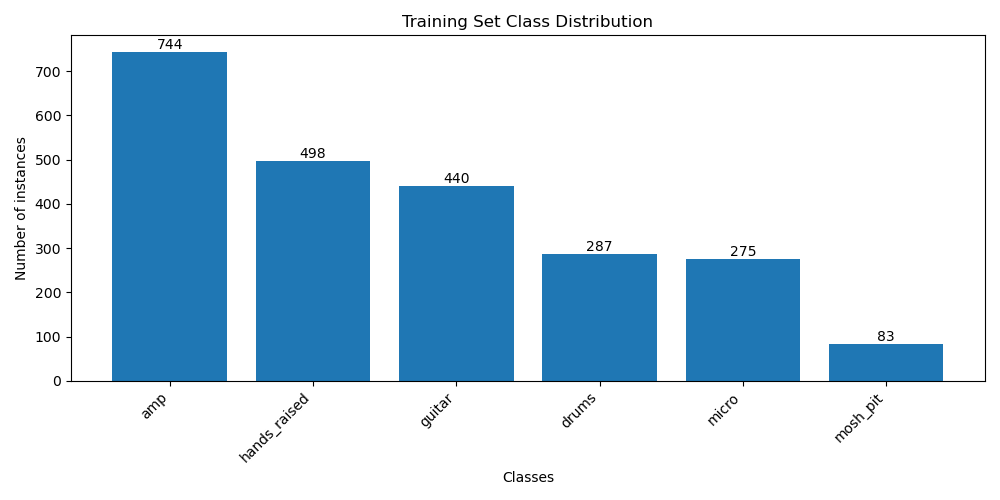

**Figure 1.** Training set class distribution.

| Class        | Instances |
| ------------ | --------- |
| amp          | 744       |
| hands_raised | 498       |
| guitar       | 440       |
| drums        | 287       |
| micro        | 275       |
| mosh_pit     | 83        |

Despite imbalance, `hands_raised` is well represented, yet remains difficult.

---

## 2.2. Luminance Distribution

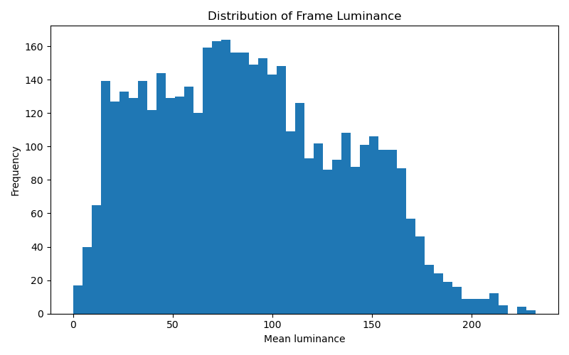

**Figure 2.** Distribution of frame-level mean luminance.

The dataset spans low to high luminance regimes, enabling structured analysis.

---

# 3. Transfer Learning as Structural Prior

Rather than presenting transfer learning as a mere performance boost, we reinterpret it as a structural prior.

## 3.1. mAP Comparison

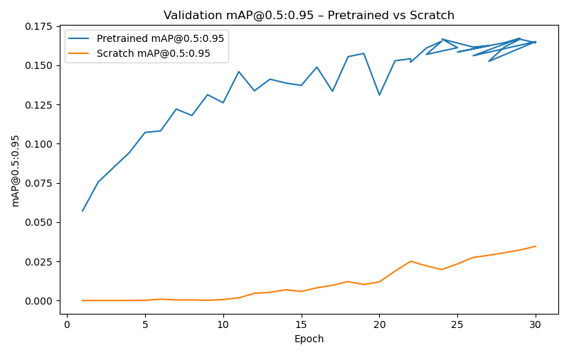

**Figure 3.** Validation mAP@0.5:0.95 — Pretrained vs Scratch.

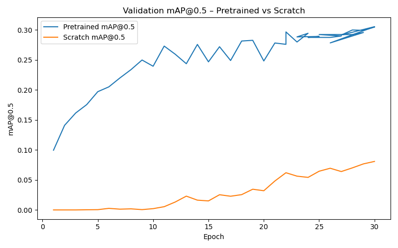

**Figure 4.** Validation mAP@0.5 — Pretrained vs Scratch.

Δ Global Metrics (Pretrained − Scratch):

| Metric    | Δ      |
| --------- | ------ |
| mAP50-95  | +0.186 |
| mAP50     | +0.327 |
| Precision | −0.212 |
| Recall    | +0.297 |

The pretrained model significantly outperforms the scratch model across all detection metrics.

This improvement is not marginal; it reflects the inability of scratch training to organize discriminative feature representations within a limited dataset.

Importantly:
- Errors are primarily false negatives.
- Cross-class confusion remains limited.

Thus, the failure mode is detection sensitivity, not semantic confusion.

Transfer learning appears to provide a feature basis capable of adapting to illumination variability, while scratch initialization fails to form stable activation patterns.

---

## 3.2 Validation Loss

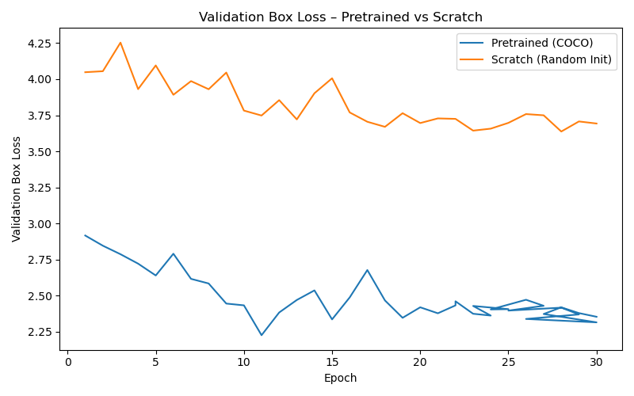

**Figure 5.** Validation box loss evolution.

Pretrained converges faster and stabilizes at lower loss.

---

# 4. Error Structure

## 4.1. Confusion Matrices

### Pretrained

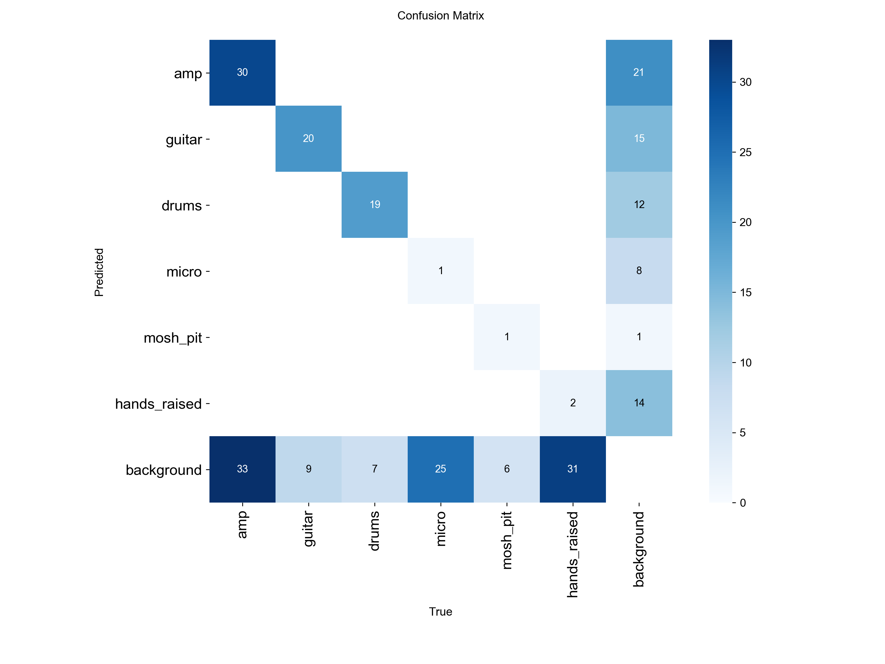

**Figure 6.** Pretrained confusion matrix.

### Scratch

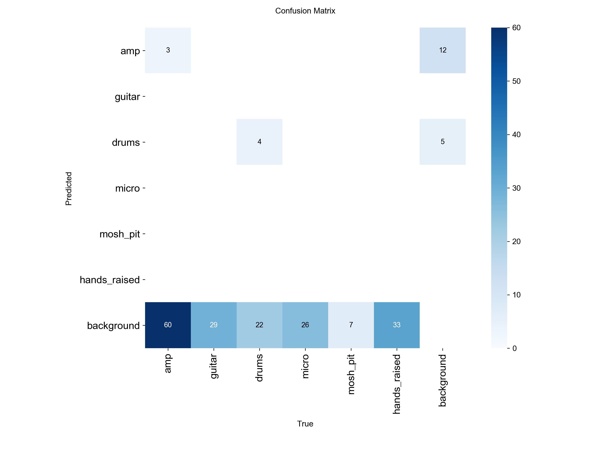

**Figure 7.** Scratch confusion matrix.

Errors are dominated by false negatives (objects predicted as background).
Cross-class confusion is limited.

---

# 5. Scene-Level Determinants of Performance

The core contribution of this work lies in linking image-level detection performance to measurable scene properties.

---

## 5.1. Luminance as Dominant Variable

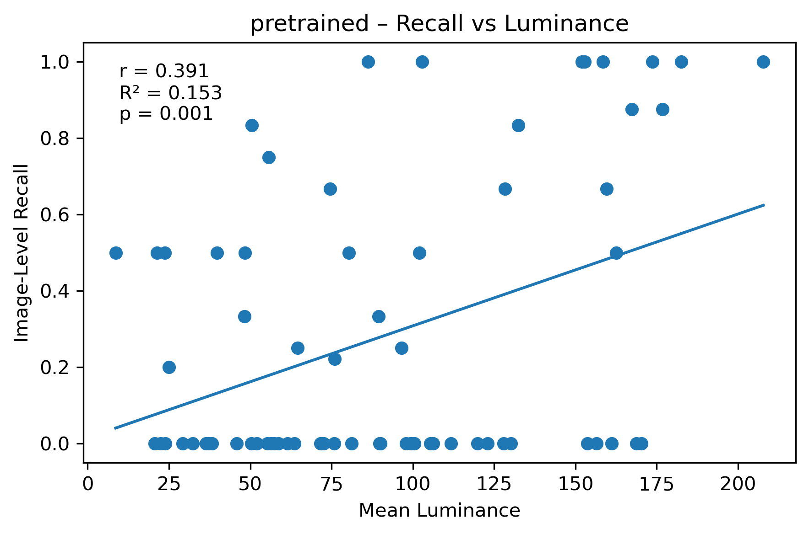

**Figure 8.** Recall vs luminance (pretrained).

or the pretrained model:
- Pearson r = 0.391
- R² = 0.153
- p = 0.001

Robust linear regression (HC3):
- β_luminance = +0.150
- p = 0.00031

Logistic GLM confirms this relationship.

No equivalent effect is observed for scratch.

This indicates:
- Pretrained convolutional filters remain sensitive to contrast-dependent structure.
- Under low luminance, feature activations weaken.
- Scratch models do not learn transferable contrast features.

Luminance is not merely correlated with performance — it significantly explains variability.

---

## 5.2. Crowd Sructure Effect

Presence of hands_raised significantly reduces recall:
- β = −0.256
- p = 0.0069

This effect persists independently of density and blur metrics.

This suggests that crowd silhouettes introduce fragmented contours and ambiguous spatial patterns that interfere with detection.

Interestingly, the degradation is not fully captured by density alone, indicating that structural ambiguity, rather than object count, drives performance loss.

## 5.3. Non-significant Variables

Contrary to expectations:
- Blur is not a significant predictor.
- Density is not a significant predictor.
- Occupied area ratio is not explanatory.

Illumination dominates the variance structure.

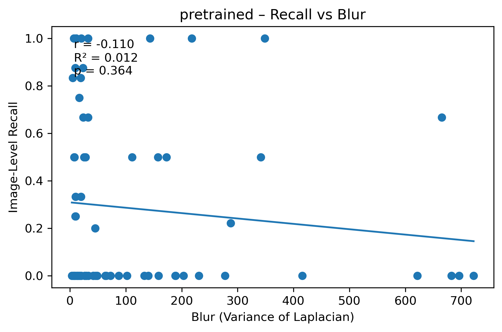

**Figure 9.** Recall vs blur.

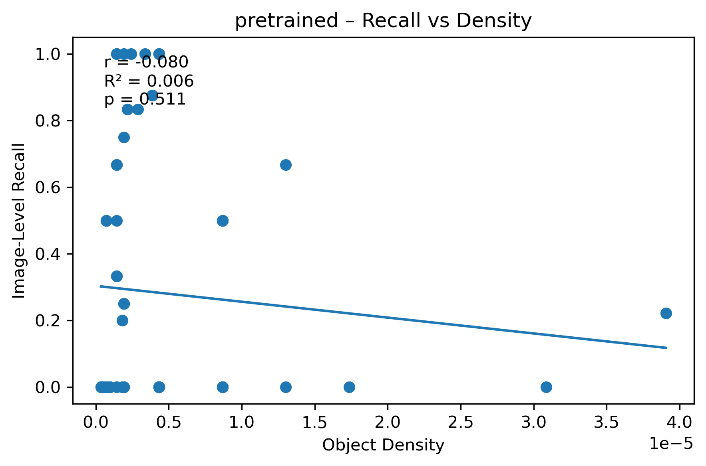

**Figure 10.** Recall vs density.

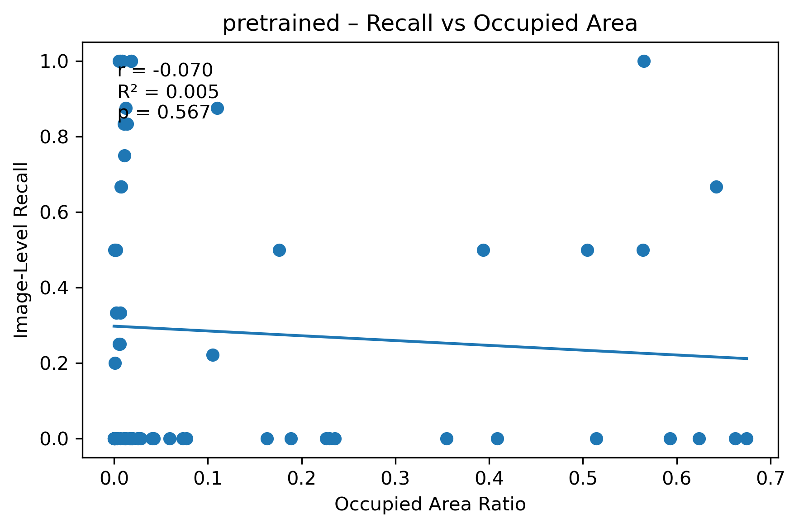

**Figure 11.** Recall vs occupied area.

---

# 6. Scratch Model Analysis

Scratch model shows no structured relationship.

---

## 6.1. Scratch - Luminance

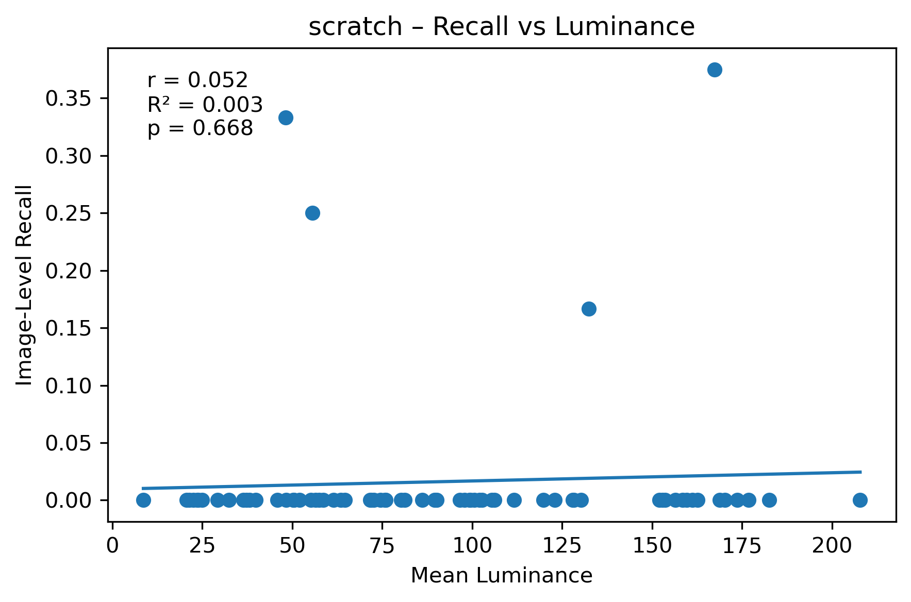

**Figure 12.** Scratch recall vs luminance.

No significant effect.

---

## 6.2. Scratch - Blur

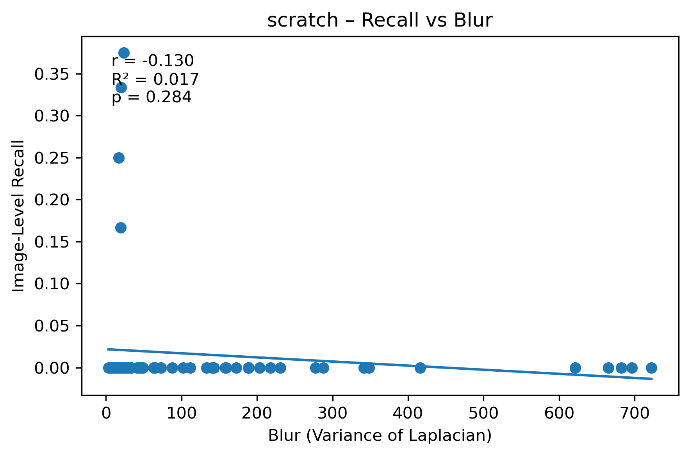

**Figure 13.** Scratch recall vs blur.

No structured relationship.

---

## 6.3. Scratch - Density

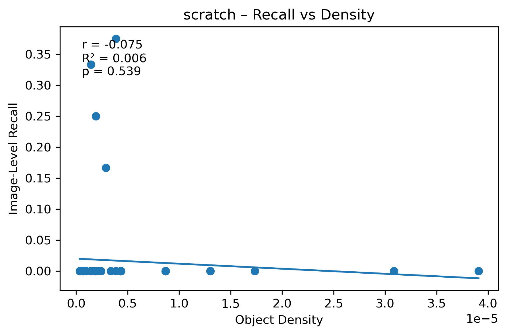

**Figure 14.** Scratch recall vs density.

No significant association.

---

## 6.4. Scratch - Occupied Area

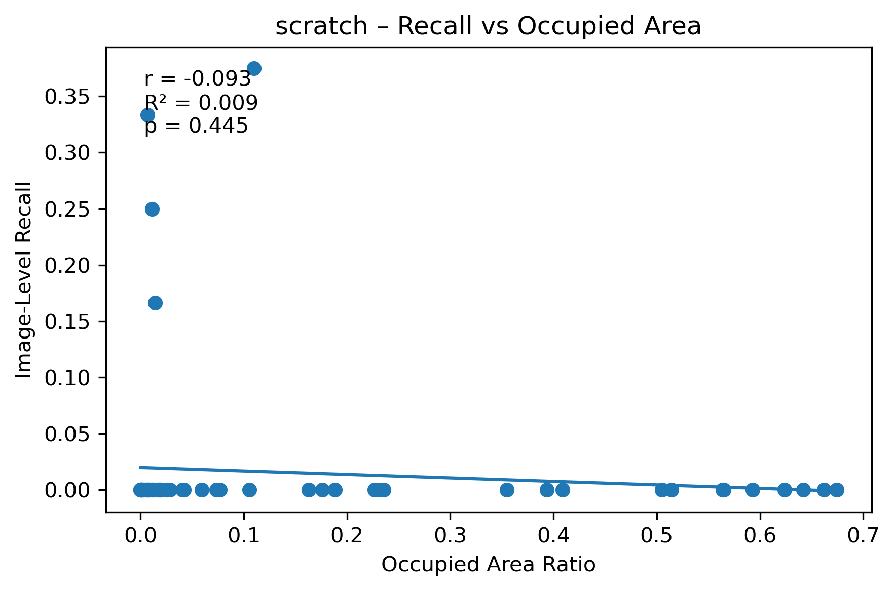

**Figure 15.** Scratch recall vs occupied area.

No structured signal.

---

# 7. Regression Analysis (HC3)

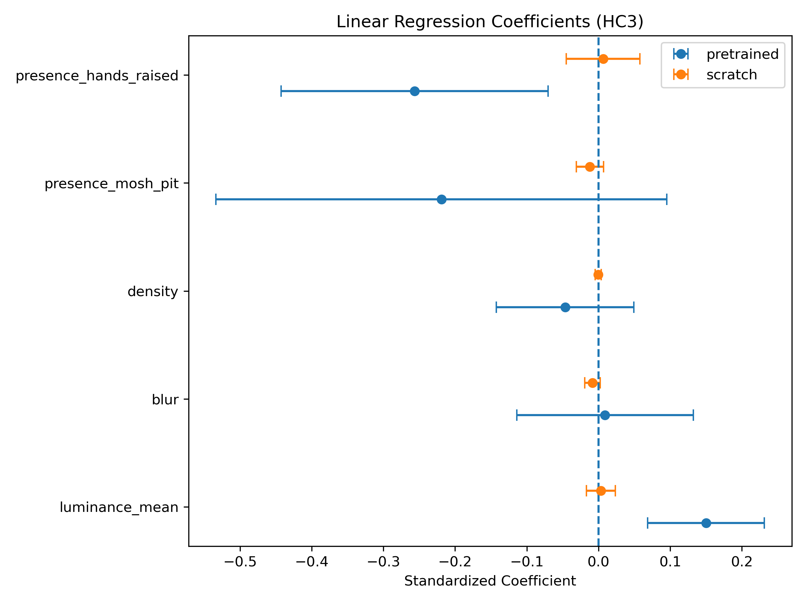

**Figure 16.** Standardized regression coefficients (HC3 robust SE).

Pretrained:

* luminance_mean → significant positive effect
* presence_hands_raised → significant negative effect

Scratch:

* no stable explanatory variable.

---

# 8. Integrating Quantitative and Qualitative Evidence

The qualitative examples reinforce the statistical findings:
- In high-luminance haze, pretrained retains structured localization.
- In low-luminance monochromatic scenes, detection weakens.
- Scratch predictions remain unstable across lighting regimes.

The consistency between regression analysis and visual inspection strengthens the interpretability of the results.

## 8.1. High-Luminance Haze

**Figure 17.** Pretrained maintains structure under haze; scratch unstable.

---

## 8.2. Low-Luminance Blue Scene

**Figure 18.** Pretrained detects sparse structures; scratch nearly inactive.

---

## 8.3. Pyrotechnic Contrast

**Figure 19.** Instrument detection remains structured in pretrained.

---

## 8.4. Monochromatic Red Scene

**Figure 20.** Extreme color dominance destabilizes localization.

---

# 9. Theoretical Implications

Main findings:

1. Transfer learning is essential in unstable lighting regimes.
2. Scene luminance significantly explains recall variability.
3. Crowd-structure presence (`hands_raised`) degrades performance independently.
4. Blur and spatial density are not dominant explanatory factors.
5. Errors are primarily false negatives.

Quantitative and qualitative analyses are consistent.

These findings suggest that:
1. Illumination variability impacts object detection primarily through contrast-dependent feature activation.
2. Transfer learning provides contrast-aware feature priors.
3. Crowd-induced structural ambiguity degrades detection beyond simple density metrics.
4. Scene-level descriptors can meaningfully explain detection variability.

This positions the work not as a simple applied fine-tuning experiment, but as an analysis of performance variability mechanisms.

---

## 10. Limitations
- Single architecture (YOLOv8)
- Static frame analysis (no temporal modeling)
- Moderate dataset size
- Domain-specific dataset

---

# 11. Conclusion

Object detection variability in volatile concert environments is structured and statistically explainable.

Performance is primarily driven by luminance conditions and modulated by crowd-structure presence.

Transfer learning is not merely advantageous but structurally necessary to extract discriminative features in unstable visual regimes.

---
